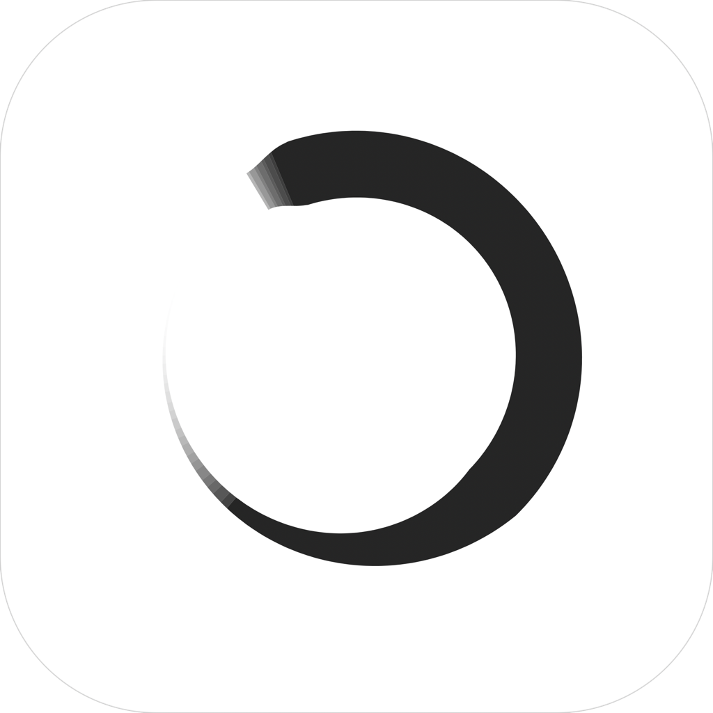
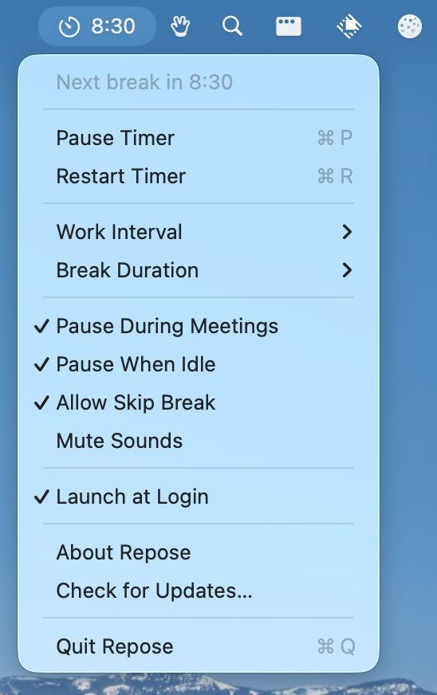

<div align="center">
  
  <h1>iCanHazRepose</h1>
  <p><strong>Take breaks from your screen. Without interrupting your meetings.</strong></p>
  <a href="https://github.com/deseven/iCanHazRepose/releases/latest/download/iCHR.dmg">
    
  </a>
  <p><sub>Free and open source. Requires macOS 13+.</sub></p>
</div>

<br/>

<div align="center">
  
</div>

<br/>

<div align="center">
  <a href="https://github.com/fikrikarim/repose">originally created by Fikri Karim</a>
</div>

<br/>

iCanHazRepose lives in your menu bar, counts down your work interval, and dims your screen when it's time to rest your eyes. When the break ends, the cycle starts again.

The difference from every other break reminder: **iCanHazRepose detects when you're in a meeting and stays out of your way.** No calendar integration, no app-specific setup. If your camera or mic is active, it knows you're on a call and waits.

The break reminder also respects full screen apps. If you're watching a movie or playing a game a small panel appears in the middle of the screen that doesn't block any input and can be dismissed by pressing Escape.

## How it works

1. Set your work interval (5–60 min) and break duration (20 sec–5 min)
2. A countdown appears in your menu bar
3. When time's up, you will receive a gentle reminder to look away
4. If you're on a call, the timer pauses automatically until you're done
5. If you step away from your computer, the timer pauses and resets when you return

<div align="center">
  
</div>

Everything is in the menu — pause, resume, restart, all settings. No separate preferences window.

## Why the meeting detection actually works

Most break apps check your calendar or look for specific apps running. Both break easily — your calendar doesn't know about the impromptu call your manager just started, and "Zoom is open" doesn't mean you're in a meeting.

iCanHazRepose checks the hardware directly. It uses CoreMediaIO to detect active cameras and CoreAudio for microphones. If something is using your camera or mic right now, you're probably in a call, so it backs off.

This means it works with Zoom, Meet, FaceTime, Teams, Slack huddles, and whatever you end up using next year. Zero configuration.

## Smart idle detection

iCanHazRepose also detects when you've stepped away from your computer. If there's no keyboard or mouse activity for 5 minutes, the timer pauses — and resets to a full work cycle when you return, since you already took a real break.

It's smart about passive screen use too: if you're watching a video (where apps keep the display awake), the timer keeps running so you still get break reminders.

## Install

### Download

**Stable** release — download from the [Releases](https://github.com/deseven/iCanHazRepose/releases) page.

**Dev** build — compiled from the `main` branch: [download](https://d7.wtf/s/iCHR-dev.zip)  
*(only use this if you need unreleased functionality or want to help with testing)*

### Build from source

```
git clone https://github.com/deseven/iCanHazRepose.git
cd iCanHazRepose
./build.sh
```

Requires Xcode 15+ and macOS 13+.

## Help & Support

- [File an issue](https://github.com/deseven/iCanHazRepose/issues/new) for bugs, suggestions, or questions
- Reddit: https://www.reddit.com/r/iCanHazApps